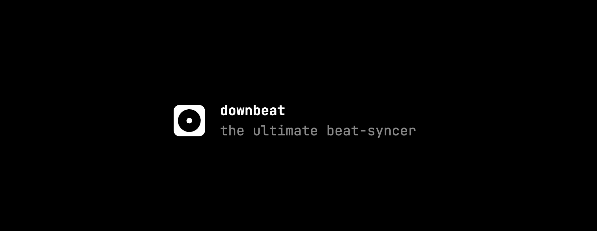

<!-- # downbeat -->

## features

- bpm guessing
- slideshow and gifs synced to the beat
- videos processed client-side
- export as mp4 and webm

these are features that are still unsure:

- addons and toppings
- more ways of syncing music with video like effects and zoom-in

## ui design

- minimalistic
- monospace
- black & white
- readable progress bar
- some kind of accent color?
- theme picker
